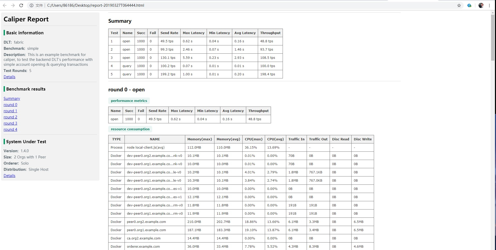

# 安装Caliper

标签（空格分隔）： caliper iri

---

## **准备工作**：
安装caliper之前需要确认本机已具备如下环境，若未安装须参照附录部分逐个安装完毕。

- NodeJs(8.X)
- Docker(18.03.0-ce以上)
- Docker-compose(1.21.0 以上)
- node-gyp

本实验安装环境如下:

 - Docker version 18.06.1-ce, build e68fc7a
 - docker-compose version 1.23.2, build 1110ad0 
 - npm version 6.4.1
 - node version v10.14.0
 - node-gyp v3.8.0
 
npm主要依赖包版本：

 - fabric-ca-client@1.4.0
 - fabric-client@1.4.0
 - fabric-network@1.4.0
 - grpc@1.14.2

## **安装步骤**
#### **下载caliper源代码**
```
$ git clone https://github.com/hyperledger/caliper.git
```

#### **切换到caliper根目录**
```
$ cd caliper
```

#### **安装依赖**
```
$ npm install
```

该命令会执行caliper根目录下的package.json脚本，安装dependencies项目下所有包。
#### **安装fabric依赖包**
```
$ npm run fabric-v1.4-deps
```
fabric-v1.4-deps脚本安装了 
```
grpc@1.14.2 
fabric-ca-client@1.4.0 
fabric-client@1.4.0 
fabric-client@1.4.0
```
也可以单独通过安装以上四个包，通过如下方式可以确认是否安装成功:
```
$ npm list fabric-ca-client
```

#### **运行测试基准**
caliper提供了5个测试基准，我们以simple为例：
```
$ npm run test -- -- --config=benchmark/simple/config.yaml --network=network/fabric-v1.4/2org1peergoleveldb/fabric-go.json
```

执行成功后会在当前目录生成一个html格式的性能报告文件。


## 附1：安装NodeJs环境
 apt-get 安装 nodejs

```
$ sudo apt-get install nodejs
$ sudo apt-get install nodejs-legacy
$ node -v 
## v4.2.6
```

 安装最新的 node v10.x

```
$ curl -sL https://deb.nodesource.com/setup_10.x | sudo -E bash -
$ sudo apt-get install -y nodejs
$ node -v 
## v10.14.1
```

如果原先已经安装了低版本的nodejs且无法更新，则需要卸载掉重新安装：
```
##卸载apt-get 
$ sudo apt-get remove --purge npm
$ sudo apt-get remove --purge nodejs
$ sudo apt-get remove --purge nodejs-legacy
$ sudo apt-get autoremove
```
手动删除 npm 相关目录
```
$ rm -r /usr/local/bin/npm
$ rm -r /usr/local/lib/node-moudels
$ find / -name npm
$ rm -r /tmp/npm*
```
## 附2：安装Docker
添加docker安装加速器：
```
$ curl -sSL https://get.daocloud.io/daotools/set_mirror.sh | sh -s http://f1361db2.m.daocloud.io
```

安装docker
```
$ sudo apt-get install docker.io
```

## 附3：下载Docker-compose
```
$ curl -L https://github.com/docker/compose/releases/download/1.24.0-rc1/docker-compose-`uname -s`-`uname -m` -o /usr/local/bin/docker-compose
$ sudo chmod +x /usr/local/bin/docker-compose
```

检查docker-compose版本：
```
$ docker-compose version
```

## 附4：安装node-gyp
安装node-gyp对系统有一定要求：

- UNIX:

  - pytyon (必须安装v2.7版本的，v3.x.x版本不支持)
 
  - make
 
  - 安装C++编译工具，如GCC

- Mac OS：

   - python

   - Xcode

- Windows:
  windows版本需要是专业版，否则会由于无法使用docker而导致无法部署。在windows上安装有红方法：
 -  方法1，以Administrator的权限运行如下命令：
  ```
  $ npm install --global --production windows-build-tools
  ```

   - 方法2，手动配置
  安装C++编译环境，要支持2.x
  安装python 2.7
  执行命令
  ```
  $ npm config set msvs_version 2017
  ```

安装node-gyp:
```
$ npm install -g node-gyp
```


## 参考资料：

https://docs.google.com/presentation/d/1MtPSBgDXf3v7DicxTNr9srB0jGmdWew2tqvItJHculo/edit#slide=id.p7<br>
https://www.jianshu.com/p/a9212848a34f<br>
https://github.com/nodejs/node-gyp<br>